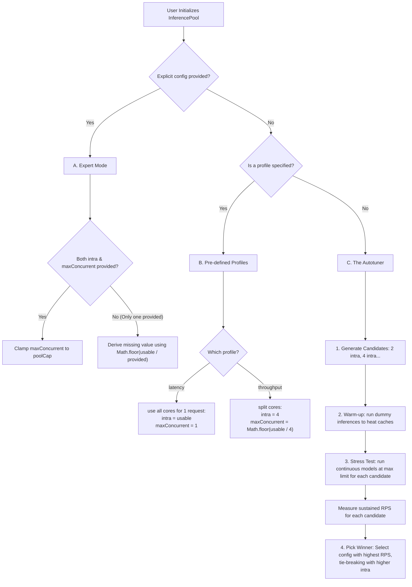

# @isidorus/cpu

High-performance TensorFlow CPU backend for Isidorus, enabling graph construction, training, and inference in Node.js environments.

### Architecture & Concurrency

**Why the Event Loop Isn't Blocked During Inference:**

The computational heavy lifting is offloaded to background threads using Node.js's native C++ addon system and the `libuv` thread pool:

1. **Async Entry Point (`runAsync`):** When inference is requested, instead of executing synchronously, a standard JavaScript Promise is returned and execution is delegated to the native C++ module.
2. **Offloading to `libuv`:** The native C++ module (`SessionWrap::RunAsync`) prepares the TensorFlow inputs but uses `uv_queue_work` to schedule the actual execution (`TF_SessionRun`) on `libuv`'s background worker pool. The main Node.js event loop immediately resumes, allowing your app to continue processing network requests.
3. **Independent Threading:** `TF_SessionRun` executes in the background. TensorFlow uses its own highly optimized threading model (configured via `intraOpThreads`) to parallelize the math computations independent of Node.js.
4. **Thread-Safe Completion:** Once `TF_SessionRun` finishes, it packages the tensor outputs and pushes them to a thread-safe internal queue. It then calls a Thread-Safe Function (`napi_call_threadsafe_function`) to signal the main thread.
5. **Resolving the Promise:** The main event loop receives the signal, briefly drains the completion queue to construct the JavaScript arrays/tensors, and resolves the Javascript Promise you `await`ed earlier.

**What Happens at High Traffic in a Real-Time Server?**

Under high load (e.g., handling many concurrent WebSocket or HTTP requests that trigger model inference), raw TensorFlow bindings present two major threats:

1. **`libuv` Thread Pool Starvation:** By default, Node.js only has 4 worker threads in the `libuv` pool. If 4 concurrent inferences occur, they occupy all 4 background threads. The main JS event loop still ticks, but any other asynchronous Node.js operations that rely on `libuv` (like reading/writing files, certain cryptography, or DNS lookups) will be stalled in a queue until an inference finishes.
2. **CPU Thrashing:** If you try to fix starvation by increasing Node's `UV_THREADPOOL_SIZE=100` and process 100 concurrent jobs, you create a new problem. If each inference uses 4 CPU cores (`intraOpThreads`), you are requesting 400 highly active threads on a machine with limited physical cores. The OS scheduler will thrash (forcefully pausing and resuming threads), resulting in astronomical latency spikes for all requests.

**The Solution: `InferencePool`**
To prevent starvation and thrashing, Isidorus provides an `InferencePool` class that protects the system:

- **Concurrency Clamping (`maxConcurrent`):** It restricts the number of active `runAsync()` calls allowed in-flight at any given moment, strictly limiting them based on your physical CPU cores and the `UV_THREADPOOL_SIZE`.
- **JS-level Queueing:** If a new request arrives while the concurrency limit is maxed out, the `InferencePool` intercepts it and holds it in a standard JavaScript Array on the main thread.
- **Graceful Degradation:** Excess requests politely wait their turn. As load spikes, overall latency increases linearly (due to queueing), but the server's CPU remains at peak efficiency, context switching overhead is avoided, and Node.js stays highly responsive to standard I/O.

**How does `InferencePool` know the optimal `maxConcurrent` value?**

Regardless of configuration, the pool always calculates two absolute hardware limitations first:

1.  **Physical Cores (`usable`):** It queries the OS for the number of physical CPU cores (or uses a strictly defined number if `reserveCores` is set).
2.  **`libuv` Thread Pool Limit (`poolCap`):** It checks `process.env.UV_THREADPOOL_SIZE` natively and unconditionally caps `maxConcurrent` so it never exceeds the worker threads actually available to Node.js.

Then, the `InferencePool` settles on the final `maxConcurrent` capability via the following decision tree:



## Features

- **Native Addon**: Uses a C++ native addon to interface directly with `libtensorflow`.
- **Automatic Setup**: Automatically handles the download and installation of required TensorFlow libraries.
- **Inference Pool**: Efficiently manage concurrent execution strategies (worker-pool vs tf-parallel).
- **Ops Library**: Rich set of operations including Math, Array, NN, and Variable ops.
- **Smart Threading**: Avoids scheduler conflicts through coordinated resource management between libuv and TensorFlow threads.

## Installation

```bash
npm install @isidorus/cpu
```

_Note: The install script will automatically attempt to resolve and download `libtensorflow` if it is missing._

## Quick Start

```typescript
import { graph, session, ops, DType } from "@isidorus/cpu";

const g = graph();
const x = ops.placeholder(g, "x", [null, 784], DType.FLOAT32);

const sess = session(g, { reserveCores: 2 });
```

## Development

### Native Builds

To rebuild the native C++ addon:

```bash
npm run build:native
```

### Prebuilds

To generate prebuilt binaries for multiple Node.js versions:

```bash
npm run prebuildify
```
